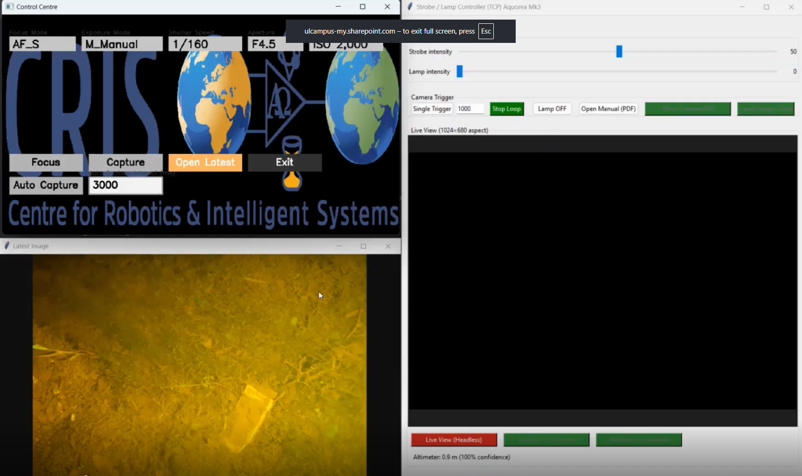

# Aquorea Mk3 — Strobe/Lamp + Camera Control GUI

A Windows-oriented Python/Tkinter application to control an **Aquorea Mk3** strobe/lamp system over TCP, drive a **Sony SDK camera app** (headless or GUI), monitor **Live View**, pop up the **latest captured image**, log **exposure counts** to CSV, pair exposures to **DSC*.JPG** files, and read a **Blue Robotics Ping1D** altimeter (UDP or serial).


---

## Table of contents

- [Highlights](#highlights)
- [Screens & Controls](#screens--controls)
- [Requirements](#requirements)
- [Installation](#installation)
- [Configuration](#configuration)
- [Quick start](#quick-start)
- [How things work](#how-things-work)
  - [TCP (Aquorea/Arduino)](#tcp-aquoreaarduino)
  - [Camera control (Sony SDK)](#camera-control-sony-sdk)
  - [Live View](#live-view)
  - [Latest Image popup](#latest-image-popup)
  - [Exposure logging + image pairing](#exposure-logging--image-pairing)
  - [Altimeter (Ping1D)](#altimeter-ping1d)
- [CSV schema](#csv-schema)
- [Packaging to EXE (PyInstaller)](#packaging-to-exe-pyinstaller)
- [Troubleshooting](#troubleshooting)
- [Notes & credits](#notes--credits)

---

## Highlights

- **Strobe/Lamp control** via TCP commands (intensity 0–100)  
- **Trigger loop** (ms hold & interval) with safety prompts  
- **Sony SDK integration**: start **headless live view** or **full GUI** by launching your compiled `RemoteCli.exe`  
- **Live View panel** (smooth, aspect-correct repaint on file mtime change)  
- **Latest Image** window that auto-tracks highest numbered `DSCxxxxx.JPG`  
- **Exposure logging** to CSV and **auto-pairing** to images within a time tolerance  
- **Blue Robotics Ping1D** altimeter over **UDP or serial** with confidence readout  
- **Session log file** per run (timestamps, commands, camera stdout)  
- **Open PDF Manual** button (bundles/opens `Aquorea Mk3 Manual.pdf`)  

---

## Screens & Controls

- **Intensities**: two sliders
  - `STROBE_INTENSITY N` (0–100)
  - `LAMP_INTENSITY N` (0–100)
- **Camera Trigger**
  - **Single Trigger** → `TRIGGER`
  - **Start/Stop Loop** → sends `TRIGGER_MS <hold_ms>` every `<interval_ms>`
  - **Lamp OFF** → `LAMP OFF`
  - **Open Manual (PDF)** → opens `Aquorea Mk3 Manual.pdf`
  - **Show Camera GUI** → restarts `RemoteCli.exe 1`
  - **Show Latest Image** → toggles the latest-image viewer
- **Live View row buttons**
  - **Live View (Headless)** → restarts `RemoteCli.exe` with no args
  - **Arduino: Retry Connect** → reconnect TCP client
  - **Altimeter: Retry Connect** → reinit Ping1D
- **Altimeter label**: `Altimeter: <distance> m (<confidence>%)`

---

## Requirements

**OS**
- Windows 10/11 recommended (paths in code use Windows examples)

**Python**
- Python 3.9+ (Tkinter included on Windows Python.org builds)

**Pip packages**
- `Pillow` (image loading/resizing)
- `bluerobotics-ping` (installs `brping` for Ping1D; optional if no altimeter)

```powershell
py -3 -m pip install pillow bluerobotics-ping
```

**External tools & files**
- **Sony SDK camera CLI** you compiled, e.g. `RemoteCli.exe`
- A Live View JPEG produced by your camera CLI (file path is configured)
- `Aquorea Mk3 Manual.pdf` placed next to `main.py` (or bundled when packaging)

---

## Installation

1. **Clone / copy** the project.
2. (Optional) **Create a venv**:
   ```powershell
   py -3 -m venv .venv
   .venv\Scripts\activate
   ```
3. **Install deps**:
   ```powershell
   pip install --upgrade pip
   pip install pillow bluerobotics-ping
   ```
4. **Put your camera exe** (`RemoteCli.exe`) in a known folder.

---

## Configuration

Open `main.py` and review the constants near the top:

```python
DEFAULT_HOST       = "192.168.2.70"
DEFAULT_PORT       = 9000
MANUAL_FILENAME    = "Aquorea Mk3 Manual.pdf"

DEFAULT_IMAGE_DIR  = r"C:\...\Sony_SDK\build\Release"     # Sony output folder
CAMERA_APP_EXE     = r"C:\...\Sony_SDK\build\Release\RemoteCli.exe"
STOP_FILE_PATH     = os.path.join(os.path.dirname(CAMERA_APP_EXE), "stop.txt")

LIVEVIEW_PATH      = r"C:\...\Sony_SDK\build\Release\LiveView000000.JPG"
LIVEVIEW_REFRESH_MS = 50
LIVEVIEW_TARGET_W   = 1024
LIVEVIEW_TARGET_H   = 680

# Ping1D (choose serial OR udp)
PING_CONNECT_MODE = "udp"          # or "serial"
PING_SERIAL_PORT  = "COM3"
PING_SERIAL_BAUD  = 115200
PING_UDP_HOST     = "192.168.2.2"
PING_UDP_PORT     = 9090
PING_REFRESH_MS   = 100

# Image pairing
MATCH_TOLERANCE_SEC = 2.0
IMAGE_PATTERN       = r"^DSC(\d+)\.(jpg)$"   # case-insensitive
```

> **Tip:** The app uses `stop.txt` as a **soft shutdown signal** for your camera exe between restarts.

---

## Quick start

1. **Set paths** in `main.py` for:
   - `DEFAULT_IMAGE_DIR` (where `DSCxxxxx.JPG` appear)
   - `CAMERA_APP_EXE` (your compiled Sony CLI)
   - `LIVEVIEW_PATH` (the live view JPEG file)
2. Ensure **Aquorea/Arduino** is reachable at `DEFAULT_HOST:DEFAULT_PORT` (TCP).
3. (Optional) Connect **Ping1D** (UDP or serial), set the constants.
4. Run:
   ```powershell
   py -3 main.py
   ```
5. The app **auto-starts** the camera app (headless), auto-connects TCP, and starts the altimeter poll.  
6. Use the controls; see log output in `session_log_<timestamp>.txt` created in the working folder.

---

## How things work

### TCP (Aquorea/Arduino)

- The app owns a simple TCP client with a background receive thread.
- Incoming lines are logged; if they carry `EXPOSURE_COUNT <N>`, they feed the **exposure logger**.
- Commands sent (examples):
  - `TRIGGER`
  - `TRIGGER_MS <hold_ms>`
  - `STROBE_INTENSITY <0..100>`
  - `LAMP_INTENSITY <0..100>`
  - `LAMP OFF`
  - Exposure subsystem:
    - `START_EXPOSURE_COUNT`
    - `GET_EXPOSURE_COUNT` (periodic poll while logging)
    - `STOP_EXPOSURE_COUNT`

### Camera control (Sony SDK)

- **Headless live view**: launches `RemoteCli.exe` with **no args**.
- **GUI mode**: launches `RemoteCli.exe 1`.
- **Restart** buttons create `stop.txt`, wait briefly for exit, then relaunch in the chosen mode.
- All **stdout lines** from the camera app are timestamped into the session log.

### Live View

- The app watches `LIVEVIEW_PATH` for **mtime changes** about ~20×/sec.
- On change, it reloads and resizes to a **1024×680 aspect** box inside the panel.
- Resizing the window repaints the cached image without reloading from disk.

### Latest Image popup

- A separate window that always shows the **highest-numbered** `DSCxxxxx.JPG` in `DEFAULT_IMAGE_DIR`.
- It polls the folder and only repaints when a new filename appears or on resize.

### Exposure logging + image pairing

- When you **Start** exposure logging:
  - Creates `exposure_log_<timestamp>.csv` and writes a header.
  - Clears internal queues; snapshots existing `DSC*.JPG` so only **new** files are considered.
  - Starts periodic `GET_EXPOSURE_COUNT` polling and a folder scanner.
- **Pairing logic**:
  - Tracks exposure timestamps from `EXPOSURE_COUNT` messages.
  - Tracks new image timestamps from file mtimes.
  - For each exposure, picks the **closest** image within **±`MATCH_TOLERANCE_SEC`** (default 2.0 s).
  - Writes a row to CSV and logs a `[PAIR]` line with the delta in ms.

### Altimeter (Ping1D)

- Optional, uses `brping.Ping1D`:
  - **UDP**: `connect_udp(PING_UDP_HOST, PING_UDP_PORT)`
  - **Serial**: `connect_serial(PING_SERIAL_PORT, PING_SERIAL_BAUD)`
- After `initialize()`, polls every `PING_REFRESH_MS` ms and shows:
  - `Altimeter: <distance_m> m (<confidence>%)`
- Button reflects state (green when reading OK).  
- If `brping` isn’t installed, the label suggests: `pip install bluerobotics-ping`.

---

## Packaging to EXE (PyInstaller)

A minimal one-file, windowed build that bundles the PDF:

```powershell
pyinstaller --onefile --windowed --name CRIS_Sony_ILX_Interface --icon "app.ico" --add-data="app.ico:." --add-data="StrobeCameraManual.pdf:." main.py
```

> The code uses a `resource_path()` helper for PyInstaller (`sys._MEIPASS`) so bundled files (e.g., the manual) resolve correctly.

---

## Troubleshooting

**Live View doesn’t update**
- Confirm `LIVEVIEW_PATH` exists and is being written by your camera app.
- Check session log for `[RemoteCLI]` lines; try **Live View (Headless)** again.

**No latest image shows**
- Ensure new files are named `DSCxxxxx.JPG` (case-insensitive) in `DEFAULT_IMAGE_DIR`.

**Altimeter stuck on “no data”**
- Verify connection mode and COM/IP.
- For serial, check the port and baud. For UDP, confirm host/port reachability.
- Reinstall: `pip install --force-reinstall bluerobotics-ping`.

**Camera app won’t (re)start**
- Verify `CAMERA_APP_EXE` path.
- The app writes `stop.txt` next to the EXE—ensure your EXE watches for it and exits.

**TCP connect fails**
- Confirm Aquorea/Arduino IP/port and network.
- Only one TCP client should connect at a time.

---

## Notes & credits

- **Blue Robotics Ping1D** via `brping` (installed by `bluerobotics-ping`).
- **Pillow** for image IO & resizing.
- **Tkinter** for GUI.

## 👤 Author

Luke Griffin
CRIS
University of Limerick
